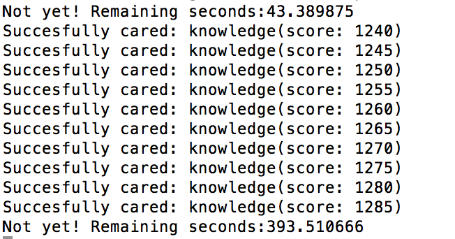

# kamergotchi-automator
Automate everything!

Python script for automating the 'care process' of your politician in the Kamergotchi app! (http://www.kamergotchi.nl/)

You have to know your player-token (```x-player-token```) this can be found by inspecting the request send by your phone to the kamergotchi API. I used Burp Suite (https://portswigger.net/burp/) to inspect the request and find my player_token.

Note: The app came out last night so I didn't have time to sufficiently test the code :)


## Screenshot

